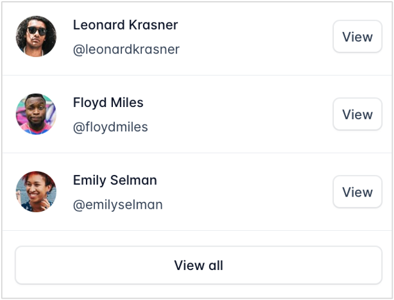
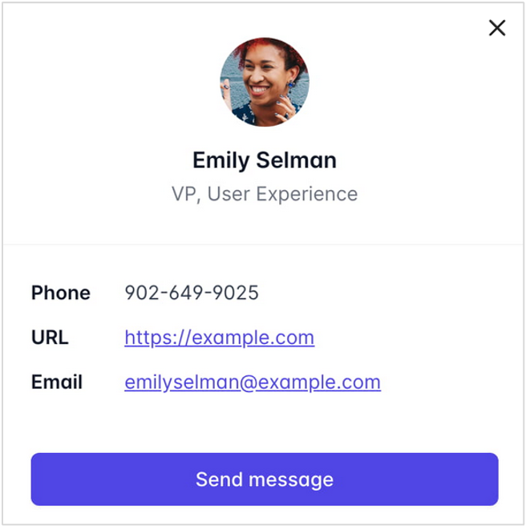

## **TEST TASK** ##
#### It is a React app which is containing Users and Profile  widget #####
##### Stack: React, Redux toolkit #####

1. [Task](./TASK.md)
2. [How to run?](#how)

State 1:  

State 2: 

### <a id='how'></a>How to run? ###

1. Clone this repository with command:
```
git clone https://github.com/therealtoresto/bondarukfe230125.git
```

2. Install dependencies:
```
npm install
```
or
```
yarn add
```

3. Run demo:
```
npm start
```
or
```
yarn start
```

Enjoy it!😉